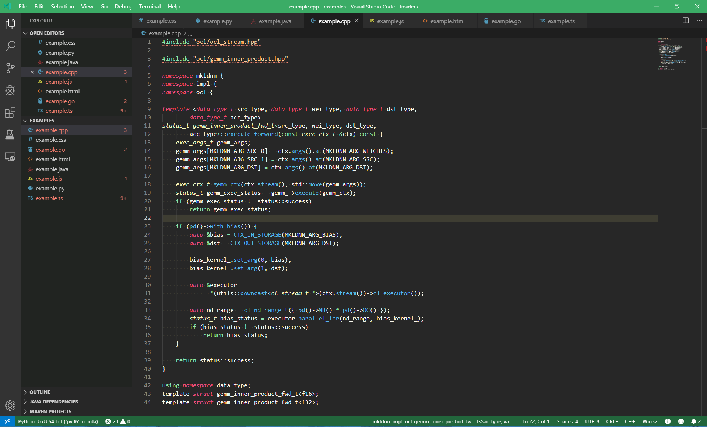
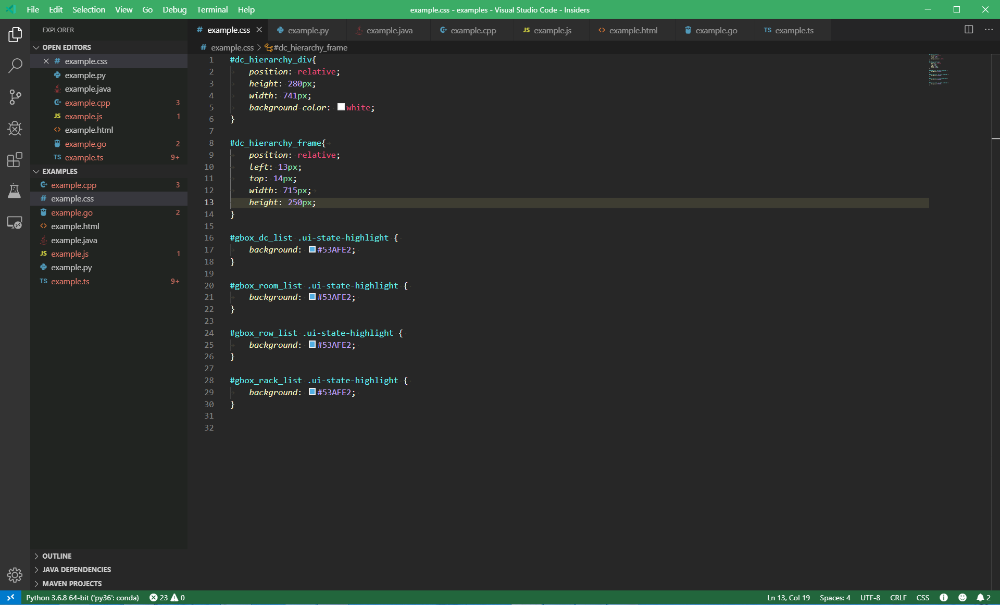
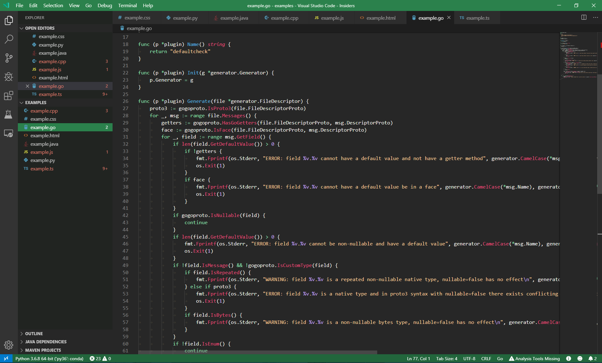
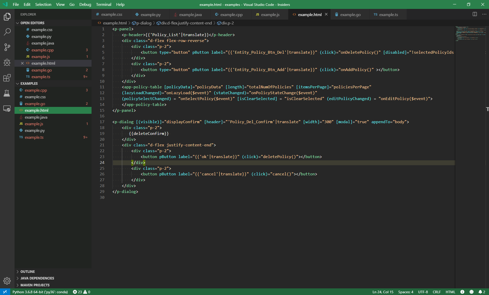
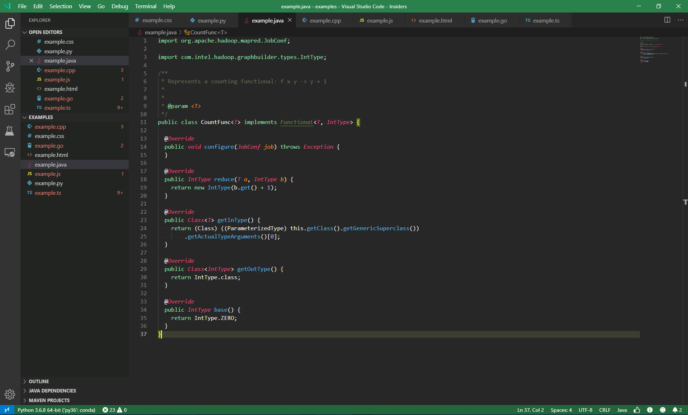
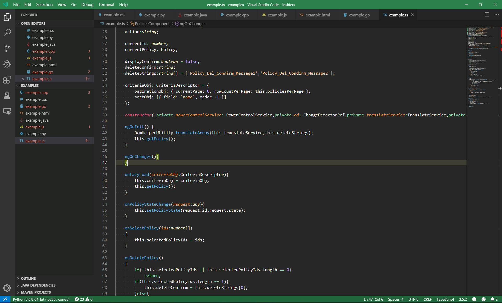

# README
## Vscode Theme Extension (Support Vscode Insiders)
**if you can't install this theme, please upgrade your vscode to latest version!**
## Examples
### cpp

### css

### go

### html

### java

### javascript

### python

### typescript

**Enjoy!**
